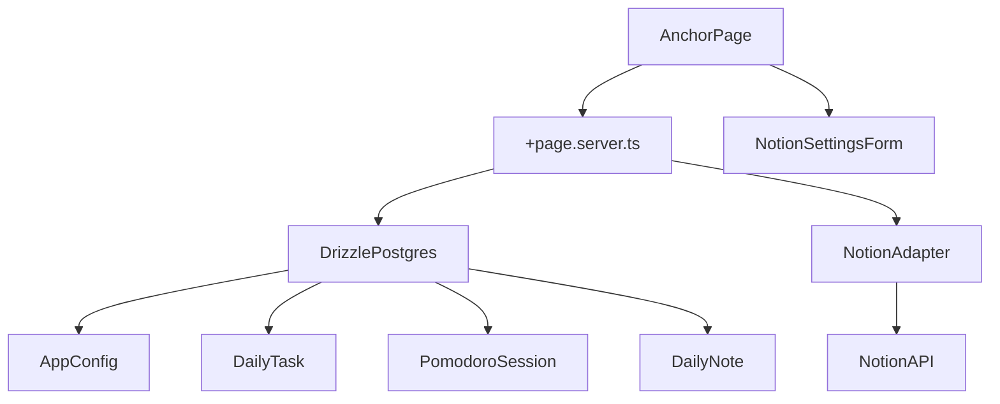

# Anchor MVP Plan (Minimal UI, Notion-Included)

## Scope and Product Decisions

- Build a **single-user MVP** first (no login/signup flow yet).
- Include **basic Notion integration in MVP** for writing/syncing core daily data, configured by users in-app.
- Keep UI intentionally simple: one page, utilitarian layout, native form controls/buttons.

## MVP Features (v1)

- Daily workspace screen to:
  - create/edit/check daily to-dos
  - run one pomodoro timer attached to a selected task
  - capture quick notes (idea dump)
- “Move unfinished tasks to next day” action.
- Minimal Notion sync for:
  - daily tasks
  - daily notes
  - optional pomodoro session summaries (if simple to map)
- Notion setup section where user can:
  - paste their Notion secret key
  - add their Notion database IDs (tasks/notes)
  - define field mapping (Anchor fields to Notion property names)

## Implementation Plan

### 1) Data model and DB foundation

- Extend Drizzle schema in [src/lib/server/db/schema.ts](src/lib/server/db/schema.ts) with MVP tables:
  - `daily_task` (id, day, title, done, carriedOver, notionPageId)
  - `pomodoro_session` (id, day, taskId nullable, durationMinutes, startedAt, endedAt, status)
  - `daily_note` (id, day, content, notionPageId)
  - `app_config` (id singleton, notionApiKey, tasksDbId, notesDbId, taskFieldMapJson, noteFieldMapJson)
- Keep existing DB wiring in [src/lib/server/db/index.ts](src/lib/server/db/index.ts); add migration workflow using existing scripts.

### 2) Server logic (SvelteKit form actions + loaders)

- Add/replace root route logic with server load/actions in new `+page.server.ts` under [src/routes](src/routes):
  - load today’s tasks, notes, pomodoro history
  - load Notion config state for settings form
  - actions for create/update/check/delete task
  - action to carry unfinished tasks to next day
  - action to save note
  - action to persist pomodoro session results
  - action to save/update Notion key, DB IDs, and mapping config
- Keep route-level architecture simple (avoid premature API route split).

### 3) Minimal one-page UI

- Replace placeholder in [src/routes/+page.svelte](src/routes/+page.svelte) with three sections:
  - **Today’s Tasks** (list + add input + checkboxes)
  - **Pomodoro** (start/pause/reset + select task + current countdown)
  - **Quick Notes** (single textarea + save)
- Add a simple **Notion Settings** section:
  - secret key input
  - tasks and notes DB ID inputs
  - mapping inputs (e.g., `taskTitle -> Name`, `taskDone -> Done`)
- No design system work yet; only spacing/readability and basic states.

### 4) Notion integration (thin adapter)

- Add `notion` client utility in `src/lib/server/notion/`:
  - initialize client from persisted app config (user-provided key)
  - map Anchor fields to Notion property names using saved mapping config
  - functions to create/update task entries and notes pages
- Add sync actions:
  - “Sync now” button for tasks/notes
  - safe retries and basic error surfacing in UI
- Store Notion IDs in DB for idempotent updates.

### 5) Environment and configuration

- Keep Notion credentials/config user-provided in app settings (not hardcoded in env for MVP UX).
- Use env only for optional fallback defaults in local development (if desired), then persist via settings.
- Keep auth variables untouched for now, but do not block app flow if auth is not used.

### 6) Basic QA and release readiness

- Manual checks:
  - add/check/carry tasks
  - run pomodoro and persist session
  - save notes
  - save Notion key + DB IDs + field mapping from settings
  - Notion sync creates/updates records without duplicates using mapping
- Smoke-check with existing scripts (`check`, `build`) before first deploy.

## Suggested Delivery Order

1. DB schema + migrations
2. `+page.server.ts` actions/load
3. `+page.svelte` minimal UI
4. Notion settings form + save action
5. Notion adapter + sync buttons with mapping
6. docs + smoke checks

## Architecture Sketch

## Out of Scope for this MVP

- Multi-user auth and per-user data isolation
- Reading list and habit tracker
- Spotify embed and Tauri desktop packaging
- Advanced timer presets/custom timer graph editor

