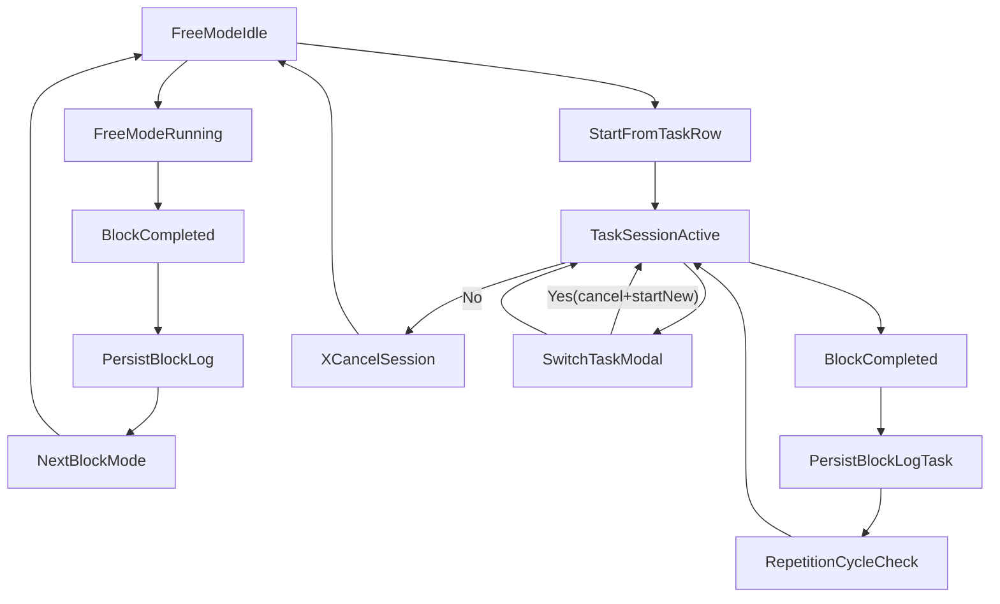

# Pomodoro Dual-Flow Implementation Plan

## Goal

Build two Pomodoro flows in `My day`:

- **Free Pomodoro**: Work/Break/Long Break, Start/Reset, remove log entries, remove linked task.
- **Session Pomodoro**: start from a task, Work/Break/Long Break controls, repetition target, persisted block log, and a left-card header showing task title with `X` cancel to return to free mode.

## Files to Change

- `[src/routes/+page.svelte](src/routes/+page.svelte)` — primary state machine + UI for both modes, task controls, log list, and switch-session modal.
- `[src/routes/+page.server.ts](src/routes/+page.server.ts)` — new actions for deleting log rows and validating session task behavior.
- `[src/lib/server/db/schema.ts](src/lib/server/db/schema.ts)` — extend `pomodoro_session` with block metadata for reliable Work/Break/Long Break logs.
- `[drizzle/0006_pomodoro_block_metadata.sql](drizzle/0006_pomodoro_block_metadata.sql)` — migration for new columns/indexes.
- `[drizzle/meta/_journal.json](drizzle/meta/_journal.json)` (+ snapshot file) — migration registration.

## Data Model Updates

Add metadata to `pomodoro_session` so each saved block is explicit (not inferred from duration):

- `blockType`: `'work' | 'break' | 'longBreak'`
- `flowType`: `'free' | 'taskSession'`
- `sessionGroupId`: text UUID to group blocks belonging to one task session run (nullable for free mode)
- `repetitionIndex`: integer (1-based), nullable for free mode
- `repetitionTarget`: integer, nullable for free mode

Keep existing `taskId`, `durationMinutes`, `startedAt`, `endedAt`, `status`.

## Frontend State/Flow Refactor

In `[src/routes/+page.svelte](src/routes/+page.svelte)`:

- Introduce explicit Pomodoro flow state:
  - `pomodoroFlow: 'free' | 'taskSession'`
  - `activeSessionTaskId` + `activeSessionTaskTitle`
  - `sessionGroupId`, `repetitionTarget`, `currentRepetition`
- Reuse existing timer engine (`startPause`, `resetTimer`, `switchMode`, `tick`) but adapt completion logic:
  - Always log completed blocks to DB (free and session mode).
  - Keep manual mode switching controls available in both flows.
- Add a **session header mode** on the left card:
  - header = active task title
  - `X` button cancels session, resets task-session state, returns to free mode.
- Add bottom **persisted log list** (Work/Break/Long Break labels + task context + delete action).
- Free mode controls:
  - keep linked-task selector + explicit `Remove linked task` action.
  - `Reset` returns timer to default work state and clears in-progress draft.
- Session mode controls:
  - show repetition control and progress (`current/target`).
  - use your chosen behavior: **repetition = full Work+Break cycle**; long break participates based on configured interval and does not itself increment cycle count.

## Task-Row Session Start Controls

In the todo list area of `[src/routes/+page.svelte](src/routes/+page.svelte)`:

- Add a start control on each task row to begin task session mode.
- If a different task session is already active, open modal:
  - Prompt: "Are you sure you want to start a different task?"
  - **Yes**: cancel current task session and start the selected task.
  - **No**: close modal, keep current session running.

## Server Actions

In `[src/routes/+page.server.ts](src/routes/+page.server.ts)`:

- Extend `saveSession` validation/input contract to accept new block/session fields and whitelist enum values.
- Add action `deleteSessionLog` (by row `id`, user-scoped) for bottom-list remove.
- Keep task ownership checks for task-linked blocks.
- Keep `load` sessions query as source of truth, optionally include any new ordering/filter fields needed by UI.

## Flow Diagram

## Validation & Test Pass

- Manual verification scenarios:
  - Free mode: start/reset, mode switch, unlink task, delete log row.
  - Task session: start from task row, repetition progress across blocks, long break insertion, cancel via `X`, task-switch confirmation modal behavior.
  - Refresh persistence: logs and session list remain accurate after reload.
- Run lint diagnostics on touched files and fix introduced issues.
- Confirm no regression to existing task CRUD and custom timers.

