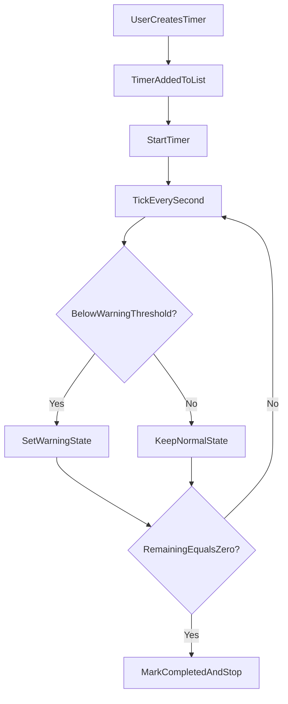

# Timebox-Style Timers Tab Plan

## Scope and Constraints

- Build a **functional match** of the linked timer concept (create timers, run them, show remaining time, warning states).
- Keep `My Day` timer behavior untouched.
- Implement inside the existing Timers tab in [src/routes/+page.svelte](src/routes/+page.svelte).

## Current Baseline

- Main tabs already exist (`my-day`, `timers`) in [src/routes/+page.svelte](src/routes/+page.svelte).
- `timers` panel is currently placeholder UI (`"Empty for now (v2)."`).
- Existing timer utilities (`formatClock`, interval lifecycle, keyboard handling patterns) can be reused as implementation reference in [src/routes/+page.svelte](src/routes/+page.svelte).

## Implementation Steps

1. Add Timers-tab state model in [src/routes/+page.svelte](src/routes/+page.svelte):
  - `timerDraft` fields (name, durationMinutes, warningMinute marks).
  - `timers[]` queue/list (id, label, totalSeconds, remainingSeconds, status).
  - runtime controls (`activeTimerId`, interval handle, completion/warning flags).
2. Replace Timers placeholder panel markup in [src/routes/+page.svelte](src/routes/+page.svelte):
  - Timer creation form.
  - Created timers list with start/pause/reset/remove controls.
  - Remaining-time display card for active timer.
  - Warning badges/messages when crossing configured thresholds.
3. Implement timer runtime logic in [src/routes/+page.svelte](src/routes/+page.svelte):
  - Create timer entries from form input.
  - Start/pause/reset single timer and enforce one running timer at a time.
  - Tick every second; update remaining time and derived warning level.
  - Mark completion and surface clear completion state.
4. Add warning UX behavior in [src/routes/+page.svelte](src/routes/+page.svelte):
  - Visual warning levels (e.g., caution at threshold 1, urgent at threshold 2).
  - Optional lightweight alert text when threshold is first crossed.
  - Ensure warning transitions are idempotent (no repeated spam each second).
5. Style the Timers tab section in [src/routes/+page.svelte](src/routes/+page.svelte):
  - Reuse existing design tokens so visuals stay consistent.
  - Add styles for timer cards, active state, warning severity, and completion state.
  - Keep responsive behavior aligned with existing page layout rules.
6. Validate behavior:
  - Manual checks: create/edit/delete timer, start/pause/reset, warning transitions, completion, tab switching.
  - Verify no regression to My Day timer interactions.

## Target Interaction Flow

## Files to Change

- [src/routes/+page.svelte](src/routes/+page.svelte) (primary: state, UI, logic, styles)
- Optional extraction only if file grows too much:
  - [src/lib/components/](src/lib/components/) for a `TimersPanel` component
  - [src/lib/](src/lib/) for small timer utility helpers

